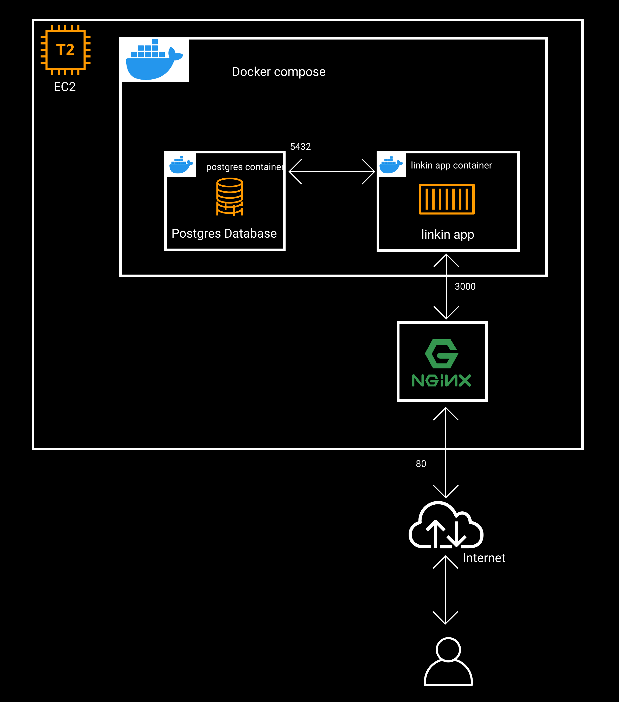

### Deploy linkin to aws with Terraform and ansible (IaC)

#### terraform

terraform will create

1. `t2.micro` ec2 instance with `root_block_device` `10Gb` `gp2`
2. security group with
   1. ingress
      1. `tcp` port 22 `ssh`
      2. `tcp` port 80 `http`
      <!-- 3. `tcp` port 3000 testing linkin app -->
   2. egress
      1. expose anywhere

`terraform apply`

#### ansible

ansible will set up docker and docker compose in the provisioned ec2 instance.
setup nginx as a reverse proxy.
clone the linkin repository via github.
run linkin app via docker compose.

`ansible-playbook main.yml -v -i hosts -l [ip] -u [username] --private-key [key.pem]`

