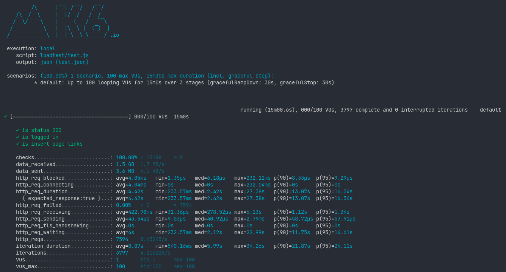
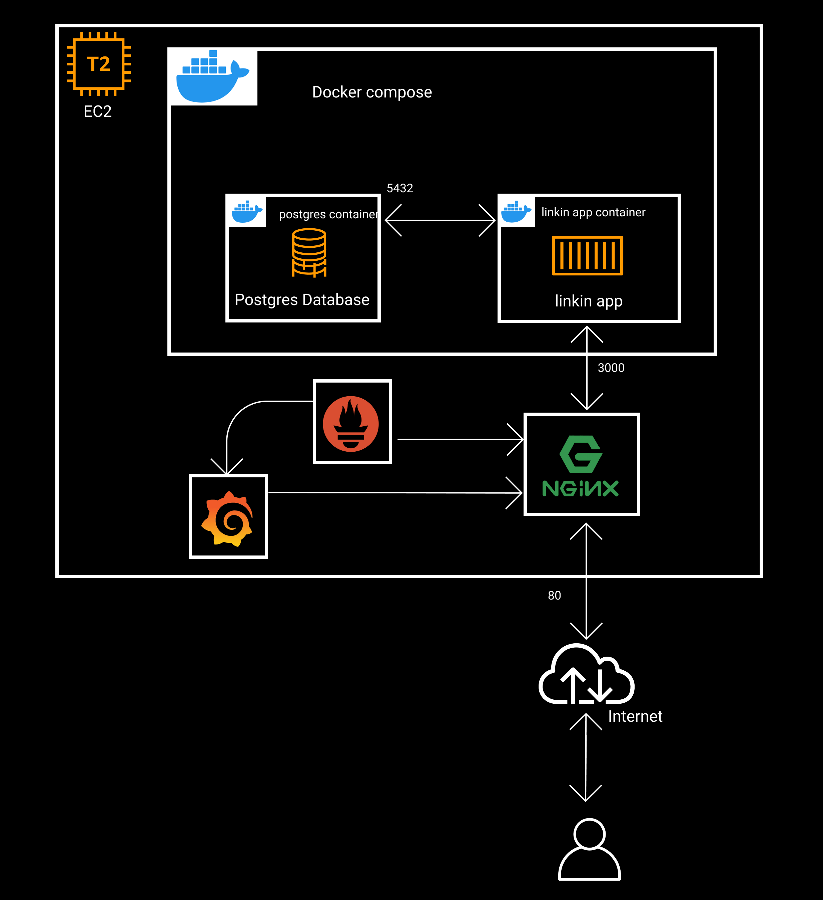
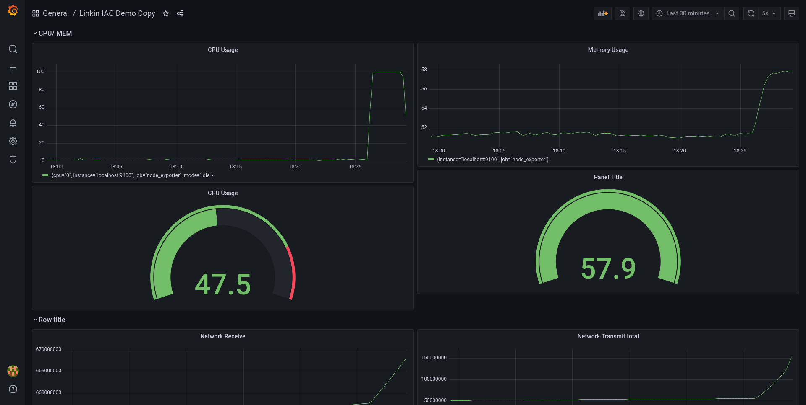
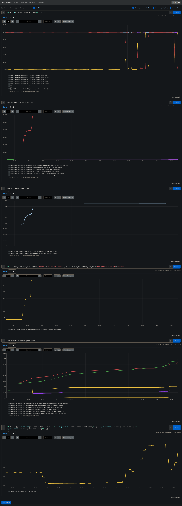

### Deploy linkin to aws with Terraform and ansible (IaC)

#### terraform

terraform will create

1. `t2.micro` ec2 instance with `root_block_device` `10Gb` `gp2`
2. security group with
   1. ingress
      1. `tcp` port 22 `ssh`
      2. `tcp` port 80 `http`
      <!-- 3. `tcp` port 3000 testing linkin app -->
   2. egress
      1. expose anywhere

`terraform apply`

#### ansible

ansible will set up docker and docker compose in the provisioned ec2 instance.

setup nginx as a reverse proxy ( proxy grafana and prometheus ).

setup prometheus and node exporter and postgreSQL exporter

setup grafana for monitoring dashboard

setup log management with loki , promtail and grafana

<!-- clone the linkin repository via github. -->

run linkin app via docker compose.

`ansible-playbook main.yml -i hosts --extra-vars "@vars.yml" --private-key [key.pem]`

access `prometheus` - `http://[ip]/prometheus`

access `grafana` - `http://[ip]/grafana` ex - `http://34.206.1.42/grafana/`

#### loadtesting

load testing carried out using k6.

[test](./loadtest/) dir



<!-- loadtest with `ab`

```bash
ab -v 4 -n 50 -c 4 -p post -T "application/json"  http://34.201.6.138/api/login
```

loadtest with `ab script`

```bash
./loadtest.sh
``` -->

<!-- todo : use k6 load testing -->

<!-- add postgres monitorung grafana

add loki for logs monitoring

-->

<!-- http://34.201.6.138/prometheus/

graph?g0.expr=100%20-%20rate(node_cpu_seconds_total%5B30s%5D)%20*%20100&g0.tab=0&g0.stacked=0&g0.show_exemplars=0&g0.range_input=15m&g1.expr=node_network_receive_bytes_total&g1.tab=0&g1.stacked=0&g1.show_exemplars=0&g1.range_input=1h&g2.expr=node_disk_read_bytes_total&g2.tab=0&g2.stacked=0&g2.show_exemplars=0&g2.range_input=1h&g3.expr=100%20-%20((node_filesystem_avail_bytes%7Bmountpoint%3D%22%2F%22%2Cfstype!%3D%22rootfs%22%7D%20*%20100)%20%2F%20node_filesystem_size_bytes%7Bmountpoint%3D%22%2F%22%2Cfstype!%3D%22rootfs%22%7D)&g3.tab=0&g3.stacked=0&g3.show_exemplars=0&g3.range_input=1h&g4.expr=node_network_transmit_bytes_total&g4.tab=0&g4.stacked=0&g4.show_exemplars=0&g4.range_input=1h&g5.expr=100%20*%20(1%20-%20((avg_over_time(node_memory_MemFree_bytes%5B30s%5D)%20%2B%20avg_over_time(node_memory_Cached_bytes%5B30s%5D)%20%2B%20avg_over_time(node_memory_Buffers_bytes%5B30s%5D))%20%2F%20avg_over_time(node_memory_MemTotal_bytes%5B30s%5D)))&g5.tab=0&g5.stacked=0&g5.show_exemplars=0&g5.range_input=15m

-->

#### architecture



#### Grafana Dashbaord



#### Prometheous Graph


