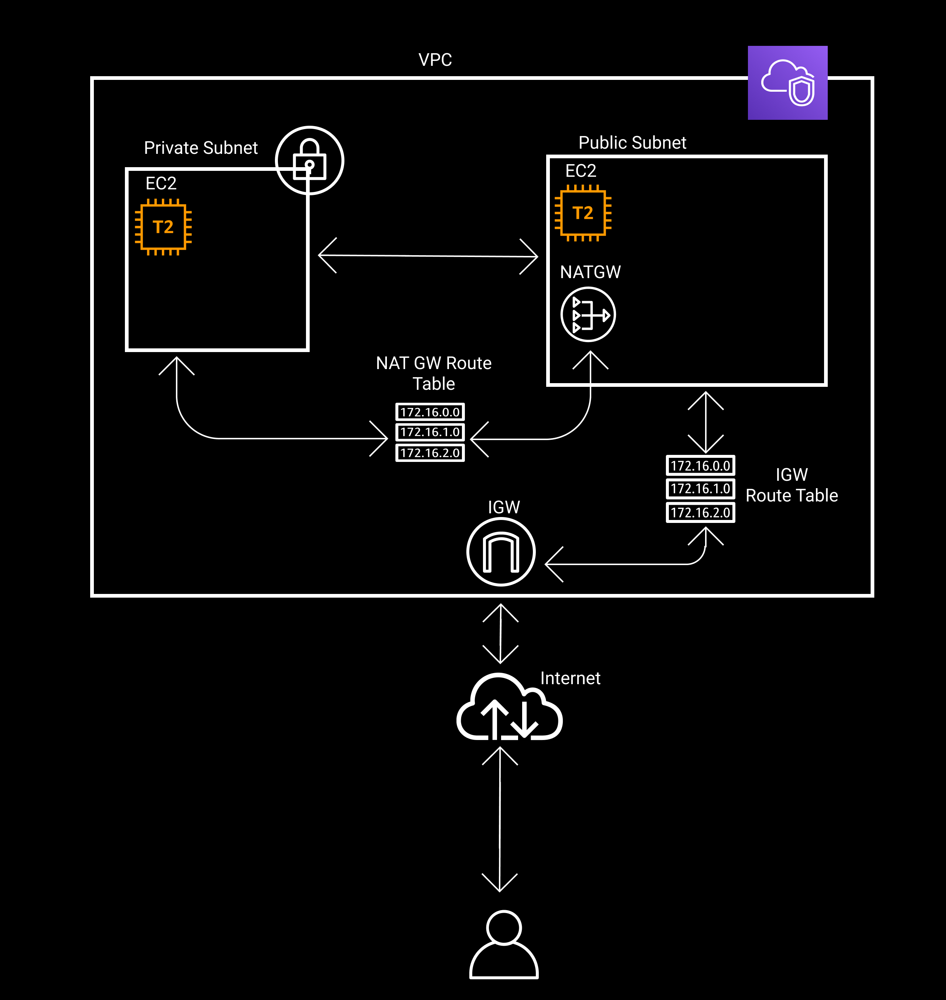

### AWS create VPC using Terraform

#### Provisioned resources in this example

1. VPC
2. IGW for Public subnet internet access
3. Elastic IP for NAT Gateway
4. NAT Gateway for Private subnet internet access
5. Route table for public subnet
6. Route table for private subnet
7. private subnet
8. public subnet
9. sg to expose ssh(22) , http(80) in public subnet
10. sg to expose ssh(22) , psql(5432) in private subnet
11. 2 ec2 instances one for public and otherwise

#### terraform

terraform will create

1. VPC with `10.0.0.0/16` cidr block
2. IGW
3. Elastic IP
4. NAT Gateway
5. public subnet with `10.0.1.0/24` cidr block
6. private subnet with `10.0.2.0/24` cidr block
7. route table with IGW associte with public subnet
8. route table with NAT Gateway associte with Private subnet
9. `t2.micro` ec2 instance with `root_block_device` `10Gb` `gp2` in public subnet
10. `t2.micro` ec2 instance with `root_block_device` `10Gb` `gp2` in private subnet
11. security group with
   1. ingress
      1. `tcp` port 22 `ssh`
      2. `tcp` port 5432 `psql`
   2. egress
      1. expose anywhere
12. security group with
   3. ingress
      1. `tcp` port 22 `ssh`
      2. `tcp` port 80 `http`
   4. egress
      1. expose anywhere

`terraform apply`

<!-- #### ansible

ansible will set up docker and docker compose in the provisioned ec2 instance.

clone the linkin repository via github.

run linkin app via docker compose

`ansible-playbook docker-install.yml  -i hosts -l [ip]  -u [username] --private-key [key.pem]` -->
