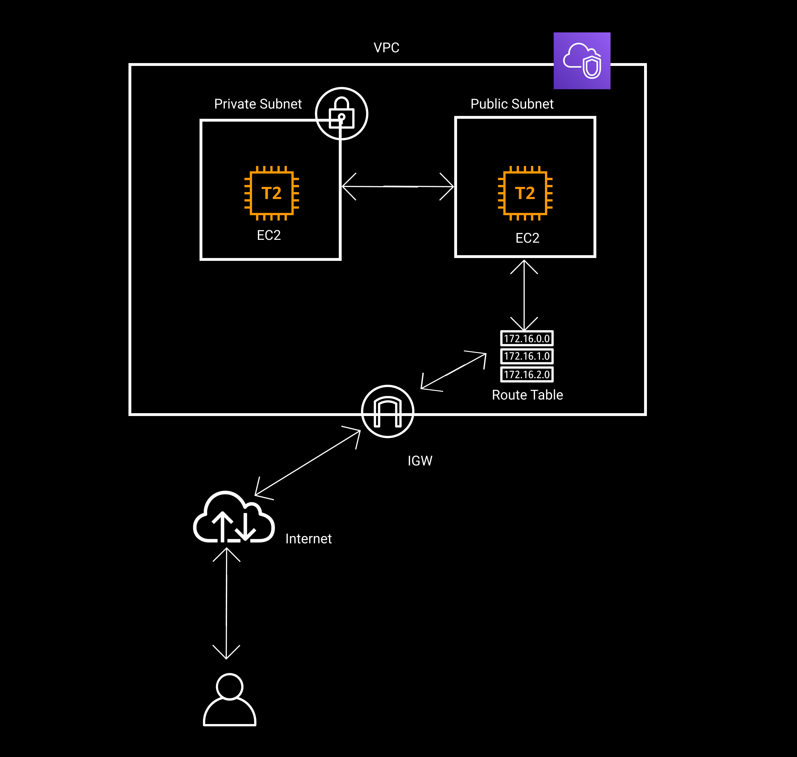

### AWS create VPC using Terraform

#### Provisioned resources in this example

1. VPC
2. IGW
3. route table
4. private subnet
5. public subnet
6. sg to expose ssh in public subnet
7. 2 ec2 instances one for public and otherwise

#### terraform

terraform will create

1. VPC with `10.0.0.0/16` cidr block
2. IGW
3. public subnet with `10.0.1.0/24` cidr block
4. private subnet with `10.0.2.0/24` cidr block
5. route table with IGW associte with public subnet
6. `t2.micro` ec2 instance with `root_block_device` `10Gb` `gp2` in public subnet
7. `t2.micro` ec2 instance with `root_block_device` `10Gb` `gp2` in private subnet
8. security group with
   1. ingress
      1. `tcp` port 22 `ssh`
   2. egress
      1. expose anywhere

`terraform apply`

<!-- #### ansible

ansible will set up docker and docker compose in the provisioned ec2 instance.

clone the linkin repository via github.

run linkin app via docker compose

`ansible-playbook docker-install.yml  -i hosts -l [ip]  -u [username] --private-key [key.pem]` -->
